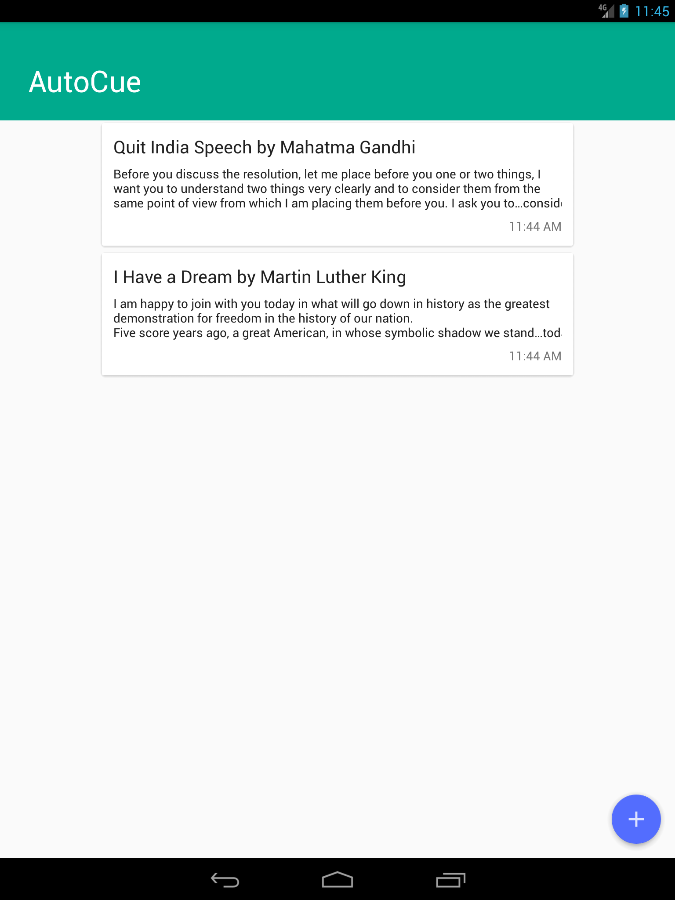

# AutoCue
  AutoCue is a teleprompter app for Android devices. It allows a presenter/content creator to read a script whilst maintaining direct eye contact
with the audience/camera. Because the speaker does not need to look down to consult written
notes, he/she appears to have memorized the speech or to be speaking spontaneously.

## Features
  * Allows for easy text file import and editing.
  * Adjustable Scroll speed and Text size.
  * Customize background and text color.
  * Mirror Text.
  
  
## Screenshot

 

